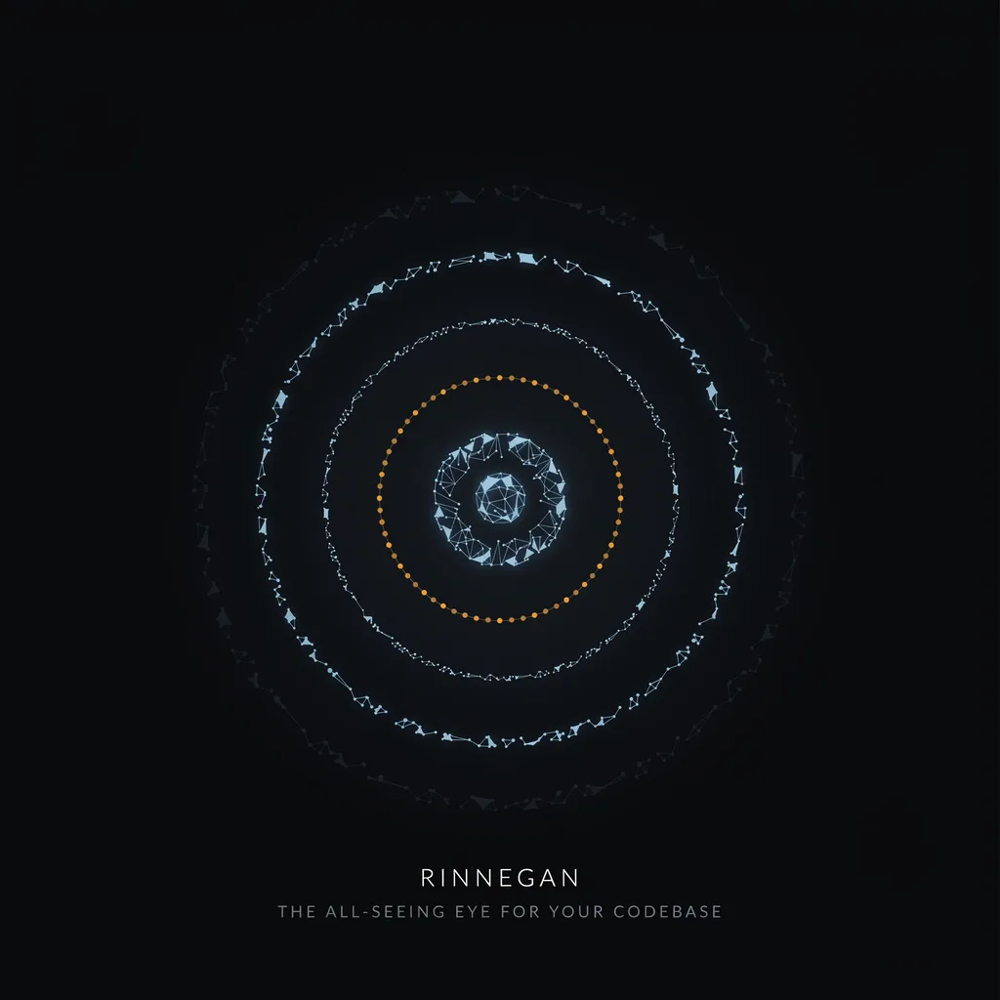
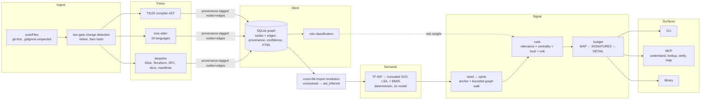
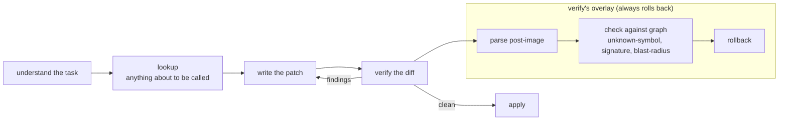

<div align="center">



# Rinnegan

**The all-seeing eye for your codebase.**

</div>

**Verifiable code-knowledge engine.** For any task, Rinnegan returns
the *minimal, maximal-signal, provenance-tagged* slice of a codebase — the smallest set of
facts an AI agent needs to write precise, hallucination-free code. Like the dōjutsu it's named
for, it perceives every path: the whole symbol graph, every edge, and the blast radius of any
change — while marking exactly which facts are ground truth.

- **Deterministic.** No neural embeddings, no AI tokenization, no external API. Same
  corpus ⇒ byte-identical index and output.
- **Semantic discovery without a model.** Classical latent-semantic analysis (TF-IDF +
  truncated SVD) — find code by meaning, fully local and reproducible.
- **Provenance on every fact.** Each graph edge is tagged `ast_exact | ast_inferred |
  heuristic | lexical | latent | unresolved` with a confidence. Only `ast_exact` is
  ground truth; everything else is visibly labeled.
- **Beats lost-in-the-middle.** Output is budgeted and position-ordered (highest signal
  at the context edges) so a fraction of a 1M window is more than enough.

Surfaces: **library** (`Rinnegan`), **CLI** (`rinnegan understand <task>`), **MCP server**
(default tools: `understand`, `lookup`, `verify`, `map`; `RINNEGAN_MCP_TOOLS=all` adds
`search`, `deps`, `refs`, `callers`, `impact`).

See `docs/superpowers/specs/` for the design and `docs/superpowers/plans/` for the build plan.

## Install & use

```bash
npm install        # better-sqlite3 ships a prebuilt binary (Node 20+)
npm run build
node bin/rinnegan.js index            # build the SQLite knowledge graph
node bin/rinnegan.js understand "how does X work"   # minimal provenance-tagged slice
node bin/rinnegan.js mcp              # MCP server (understand, lookup, verify, map)
```

Other commands: `inventory`, `verify [--staged|--diff <file|->] [--allow <names...>]`,
`search`, `deps <file>`, `refs <symbol> [--write|--read]`, `callers <symbol>`,
`tests <symbol>`, `lookup <name>`, `impact <symbol>`, `docs --stale`, `map [--mermaid]`,
`status`, `watch`. `understand` also takes `-s, --scope <domain>` to restrict the slice
to one architectural domain (see `rinnegan map`). Add `--json` to any command for
machine output.

**Agent loop.** `understand` the task → `lookup` anything about to be called → write
the patch → `verify` it → apply.

## How it works

A repo becomes a queryable graph in five stages, then gets budgeted into an answer:



**The agent loop**, and what `verify` actually does before an edit is trusted:



## Sharing the index (CI cache)

The index is one file: `.rinnegan/graph.db`. Cache it in CI so warm runs update instead
of reindexing cold.

```yaml
- run: npm ci && npm run build
- uses: actions/cache@v4
  with:
    path: .rinnegan
    key: rinnegan-${{ runner.os }}-${{ github.sha }}
    restore-keys: rinnegan-${{ runner.os }}-
- run: node bin/rinnegan.js index
```

`bin/rinnegan.js` runs the built `dist/cli/main.js`, so install + build must happen
before `index` regardless of cache state; the cache only covers `.rinnegan`, so its
position relative to `npm ci`/`npm run build` doesn't change correctness — it's placed
after here to follow the standard deps-then-build-then-restore-artifacts order.

`index`'s two-gate change detection (mtime, then hash) means a restored cache only
reparses what changed since it was written — not the whole repo. Confirm two machines
(or a cache restore vs. the working tree) hold the same corpus:

```bash
node bin/rinnegan.js status --json | jq .fingerprint
```

No S3 or git-backed store for the index — it's a single SQLite file, so `actions/cache`
(or a plain `cp`) is the whole sharing story.

## Pre-commit gate

```bash
echo 'rinnegan verify --staged || exit 1' >> .git/hooks/pre-commit && chmod +x .git/hooks/pre-commit
```

Unknown-symbol and parse-failure errors block the commit; signature echoes and
blast-radius warnings inform but never fail it.

## Purpose

Rinnegan is **internal machinery for AI coding agents**, not a user-facing graph tool.
Its sole job: hand any attention-limited / sparse-attention model the *exact signal* it
needs to make precise, no-nonsense edits to an existing codebase — and nothing else.

**Harmonic memory.** `understand` returns three zoom tiers in one budget so the model
gets the shape first and the exact lines last:
`MAP` (symbols by file) → `SIGNATURES` (the spine at a glance, definitions only) →
`DETAIL` (whitespace-minified, provenance-tagged source to edit). Deterministic — no LLM
summarization (that is cognee's bloat; we reject it and keep only the multi-resolution idea).

**Any agent.** `rinnegan install <agent>` emits MCP config for Claude Code, Cursor, Codex,
Kiro, Pi, Windsurf, Gemini. MCP stdio is the universal transport.

## Coverage (v0.1)

**Code — 23 languages.** TS/JS (compiler API, type-aware method resolution) + Python,
Go, Rust, Java, PHP, C#, Ruby, C, C++, Swift, Kotlin, Scala, Zig, Lua, Solidity,
Objective-C, Bash, OCaml, ReScript (tree-sitter, verified spec registry — adding a
grammar is one table entry), plus **Elixir** (def/defmodule macros parsed as call nodes)
and **Terraform/HCL** (block defs + `var.*`/resource/module traversal references) via
bespoke extractors. The Terraform grammar is vendored under `vendor/wasm/` (ABI-compatible,
not in tree-sitter-wasms).

**Composite SFCs — Vue / Svelte / Astro.** The `<script>` block is sliced out textually,
parsed with the precise TS/JS extractor, and line numbers are remapped back to the original
`.vue/.svelte/.astro` file — one code path, no SFC grammar required.

**Non-code.**
- **Docs** (`.md/.mdx/.rst/.txt`): markdown links + `[[wikilinks]]` → `references` edges between docs.
- **Manifests** (`package.json/go.mod/pyproject.toml/pom.xml/cargo.toml/apm.yml`): one
  canonical package **hub** node per dependency (shared across manifests) + depends_on edges.
- **MCP configs** (`.mcp.json/mcp.json/claude_desktop_config.json`): server nodes with
  command/args/env requirements + package refs.

**Skipped, with reason (verified by probe, never assumed):** Dart (grammar is ABI v15;
web-tree-sitter runtime supports 13–14 — no compatible build sourced); YAML/Elm/QL (wasm
fails to load under the runtime); CSS/HTML/JSON/TOML (load fine, but no clean def/call model
beyond what the manifest/MCP extractors already cover).

## Status

Working end-to-end: SQLite provenance graph · scope-aware TS/JS extraction
(read/write tags, honest unresolved boundaries) · **cross-file import resolution** ·
**Python + Go extractors** (tree-sitter WASM) · deterministic sparse LSA+BM25 semantic
search · signal engine (minimal spine → provenance rank → budget → position-order →
whitespace-minimized verifiable render) · **incremental file watcher** · library + CLI +
MCP server. 170 tests, including byte-determinism and slice-quality gates.

**v0.2 surface:** a freshness guard (mtime/hash change detection, exposed as a
fingerprint) keeps reads honest about a stale index, file roles back `inventory`, the
new `verify` engine backs the pre-commit gate alongside `lookup`, `map`/domains scope
`understand`, docs get a staleness check (`docs --stale`), and tests are linked back to
the symbols they cover.

**Measured on real codebases:**
- Its own source: task slice **~85% smaller** than dumping the repo, all `[ast_exact]`,
  **~0.3% of a 1M window**.
- repomix (380 TS files, 9.9k symbols): full index in **~6s**, cold `understand` ~1.8s.
- grepai (198 Go files): `understand "vector store search"` returns the three `Search`
  backend impls + dedup — correct, by meaning, deterministic.

**Next:** richer cross-file/type-aware resolution (method calls), more languages,
daemon hardening (Win/WSL/SMB), eval corpus growth.

## Changelog

Terse and reverse-chronological; see `git log` for the full detail this compresses.

### 2026-07-04 — v0.2: anti-hallucination roadmap
- **Added:** freshness guard (mtime/hash reconciliation before every read) · file role
  classification + `inventory` (roles, inbound edges, orphans) · `verify` engine
  (unified-diff parser, graph-native unknown-symbol/signature-echo/blast-radius/
  parse-failure checks) behind a pre-commit gate · `lookup` (exact facts, explicit NOT
  FOUND) · domain detection (label propagation) + `map` (md/mermaid/json) +
  `understand --scope` · `docs --stale` · test linkage (`tests <symbol>`, covered-by
  lines) · corpus fingerprint in `status` · `lookup`/`verify` as MCP tools.
- **Fixed** (same-day follow-up pass): per-call-site edges (dedup keyed by line, not
  just symbol pair); `removeFile` downgrades inbound cross-file edges to `unresolved`
  instead of deleting them, and downgraded placeholders now re-resolve through
  aliased/default imports; domain/mermaid labels route correctly under name
  collisions; `.js`/`.mjs`/`.cjs` specifiers resolve to their TS source (NodeNext).

### 2026-07-03 — roadmap planning
- **Added:** the anti-hallucination roadmap spec, a spec amendment (freshness guard,
  lookup tool, stale-docs, test linkage), and a 20-task/5-phase implementation plan —
  docs only, no code.

### 2026-06-30 — v0.1: core engine
- **Added:** the whole v0.1 core in one day — provenance-centric node/edge types,
  SQLite graph store (FTS5 + WAL), git-first scanner, scope-aware TS/JS extractor,
  cross-file import resolution, deterministic LSA + BM25 + RRF semantic search, the
  minimal-spine signal engine with harmonic MAP/SIGNATURES/DETAIL output, library +
  CLI + single-tool MCP server, an incremental file watcher, type-aware method-call
  resolution, 19 tree-sitter grammars (Python/Go/Rust/Java/PHP/C#/Ruby/C/C++/Swift/
  Kotlin/Scala/Zig/Lua/Solidity/Objective-C/Bash/OCaml/ReScript), Elixir + Terraform
  bespoke extractors, Vue/Svelte/Astro SFC support, docs/manifest/MCP-config
  extractors, the agent MCP `install` command, and the determinism/slice-quality
  eval corpus.
- **Changed:** renamed the project veridex → rinnegan (package, bin, CLI, MCP, lib,
  index dir) and added the Rinnegan branding/hero banner.
